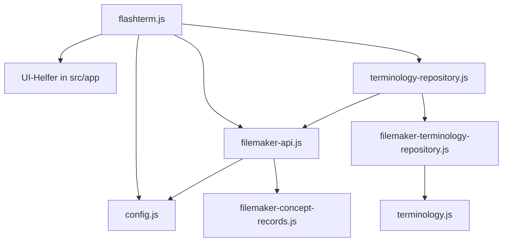

# Startprozesse und Optimierungspotenzial: flashterm STAGE

Stand: 16. August 2026

## Zweck und Abgrenzung

Dieses Dokument beschreibt die tatsächlich implementierten Startprozesse von flashterm STAGE. Es unterscheidet zwischen dem produktiven Browserstart, dem lokalen Entwicklungsserver und dem Teststart. Die beschriebenen Optimierungen sind Vorschläge und ändern den charakterisierten Ist-Zustand nicht.

Sicherheitsrelevante Konfigurationswerte werden bewusst nicht wiedergegeben. `config.js` bleibt eine lokale, ignorierte Datei und ist für den Anwendungs- und Entwicklungsstart erforderlich.

## 1. Einstieg über `index.html`

Der reguläre Einstieg erfolgt über die Stamm-URL der Installation:

1. Der Webserver liefert `index.html` aus.
2. Ein synchrones Inline-Skript liest `window.location.search` vollständig aus.
3. Der Browser navigiert zu `./flashterm.html` und hängt die unveränderte Query-Zeichenkette an.
4. Falls die automatische Navigation nicht ausgeführt wird, erhält der Fallback-Link dasselbe Ziel einschließlich aller Query-Parameter.

Damit bleiben nicht nur `source` und `target`, sondern auch unbekannte Parameter bei der Weiterleitung erhalten. Erst `flashterm.js` beschränkt die fachliche Auswertung auf `source` und `target`.

Ein direkter Aufruf von `flashterm.html` überspringt diese Weiterleitung und startet die Anwendung unmittelbar.

## 2. Laden von `flashterm.html`

Der Browser verarbeitet beim Laden der Hauptseite mehrere voneinander unabhängige Ressourcen und Skripte:

1. Er lädt Favicon, `flashterm.css`, Logo und weitere statische SVG-Ressourcen nach Bedarf.
2. Die HTML-Struktur stellt zunächst Header, Suche, Modusnavigation, Ladeanzeige, leere Inhaltscontainer, Sprachmodal und Footer bereit.
3. Am Ende des Dokuments werden externe Laufzeitbibliotheken geladen:
   - SheetJS für Excel-Exporte,
   - ein `URLSearchParams`-Polyfill.
   Fachinformationen enthalten bereits HTML und benötigen keine Markdown-Bibliothek.
4. Ein Inline-Skript setzt Logo und Favicon entsprechend `prefers-color-scheme` und registriert einen Listener für spätere Theme-Wechsel.
5. Das ES-Modul `flashterm.js` wird geladen. Dessen Modulabhängigkeiten werden vor seiner Ausführung aufgelöst.
6. Ein weiteres klassisches Inline-Skript lädt unabhängig davon `json/languages.json` und füllt den Zielsprach-Selector zunächst mit lokalen Sprachdaten.

Der vorhandene `<link>`-Tag für Google Fonts und Font Awesome ist syntaktisch auffällig: Er enthält zwei `href`-Attribute, aber kein `rel="stylesheet"`. Er ist deshalb kein verlässlicher Bestandteil des Startprozesses.

## 3. Modulabhängigkeiten

Vor der Ausführung von `flashterm.js` lädt der Browser dessen statischen Abhängigkeitsbaum:



Die Browser-Composition in `src/app/terminology-repository.js` verbindet die FileMaker-Funktionen mit dem Repository. Das Repository normalisiert Sprach-, Terminologie- und Concept-Daten über die reinen Domain-Mapper, bevor sie die UI erreichen.

Kann eine statische Modulabhängigkeit – insbesondere `config.js` – nicht geladen oder geparst werden, wird `flashterm.js` nicht ausgeführt. In diesem Fall gibt es keinen kontrollierten Anwendungsfehler aus `initialize()`.

## 4. Unmittelbarer Modulstart

Sobald der Modulbaum verfügbar ist, führt `flashterm.js` synchron folgende Schritte aus:

1. `getLanguageParamsFromURL()` liest `source` und `target`.
2. Fehlende Werte fallen zunächst auf `config.initialSourceLanguage` und `config.initialTargetLanguage` zurück; für ein weiterhin fehlendes Target wird `''` verwendet.
3. Die GUI-Sprache wird aus der Browserlocale ermittelt.
4. DOM-Referenzen und initiale Modulzustände werden aufgebaut.
5. Die zentralen Event-Listener werden genau einmal registriert.
6. `switchMode("wiki")` aktiviert unmittelbar den Wiki-Modus.
7. `initialize()` wird aufgerufen, aber nicht abgewartet.
8. Der Zustand `starting` zeigt die Ladeanzeige und deaktiviert datenabhängige Bedienelemente. Die Modusnavigation bleibt verfügbar.

Die Anwendung besitzt damit eine synchrone UI-Startphase und eine parallel dazu laufende asynchrone Dateninitialisierung. URL-Sprachcodes werden zu diesem Zeitpunkt nicht gegen die tatsächlich verfügbaren Sprachen validiert. Ein Guard verhindert, dass mehrere Initialisierungen gleichzeitig laufen.

## 5. Asynchrone Anwendungsinitialisierung

`initialize()` arbeitet die folgenden Schritte strikt seriell ab:

```mermaid
sequenceDiagram
    participant UI as Browser/UI
    participant Init as initialize()
    participant FM as FileMaker Data API
    participant Static as Statische JSON-Dateien
    participant Cache as sessionStorage

    UI->>UI: Event-Listener einmalig registrieren
    UI->>Init: Zustand starting; initialize() starten
    Init->>FM: Neue Session anfordern
    FM-->>Init: Token
    Init->>Cache: Token und lokale Ablaufzeit speichern
    Init->>Static: translations.json laden
    Static-->>Init: GUI-Texte
    Init->>Cache: Sprachcache V3 prüfen
    alt gültiger Cache für GUI-Sprache
        Cache-->>Init: normalisierte Sprachoptionen
    else Cachemiss
        Init->>FM: Sprachoptionen laden
        FM-->>Init: Sprachrecords
        Init->>Cache: normalisierte Optionen speichern
    end
    Init->>Init: Eindeutige Source ermitteln; URL korrigieren
    Init->>FM: Quellterminliste laden
    FM-->>Init: Termrecords
    Init->>FM: Zielterminliste laden
    FM-->>Init: Termrecords
    Init->>UI: Titel und Modustexte aktualisieren
    Init->>UI: Wiki-Startfläche anzeigen
    alt alle Startschritte erfolgreich
        Init->>UI: Zustand ready
    else nicht kritischer Datenfehler
        Init->>UI: Zustand degraded mit Wiederholungsaktion
    end
```

### 5.1 FileMaker-Login

`loginToFileMaker()` wird bei jedem vollständigen Anwendungsstart aufgerufen, auch wenn im `sessionStorage` noch ein lokal gültiger Token liegt. Der Browser sendet die in `config.js` hinterlegten Anmeldedaten an den Session-Endpunkt. Bei Erfolg speichert er:

- `fmToken`,
- `fmTokenExpiration` mit einer lokal berechneten Laufzeit von 15 Minuten.

Ein Loginfehler wird in eine generische Fehlermeldung übersetzt und beendet den aktuellen Initialisierungsversuch. Die UI wechselt in `failed`, lässt die Modusnavigation aktiv, hält datenabhängige Bedienelemente deaktiviert und bietet eine lokalisierte Wiederholungsaktion an.

### 5.2 GUI-Sprache und Übersetzungen

Die GUI-Sprache wird bereits vor dem Login bestimmt:

- Browserlocale beginnt mit `de` → `de-DE`,
- alle anderen Locales → `en-GB`.

Anschließend wird `json/translations.json` geladen und die vorhandenen übersetzbaren UI-Elemente werden aktualisiert. Ein Fehler wird protokolliert, aber innerhalb von `loadGuiTranslations()` abgefangen; die Initialisierung läuft danach weiter.

### 5.3 Sprachoptionen und Cache

`fetchAndCacheLanguageOptions()` prüft einen quellspezifischen `sessionStorage`-Eintrag. Der FileMaker-Modus verwendet `languageData:<Datenbankname>`, der Stage-Modus `languageData:termbase:<Termbase-ID>:publication:<Publication-ID>`. Wiederverwendet wird ausschließlich ein syntaktisch gültiges V3-Envelope für die aktuelle GUI-Sprache. Es enthält neben Sprachcode und Name die normalisierte Source-Kennzeichnung. Der frühere V2-Cache wird bewusst verworfen. Bei einem Cachemiss lädt das Repository die Sprachoptionen aus der aktiven Quelle und speichert die normalisierte Liste wieder im Session Storage. Dadurch können weder Sprachdaten einer anderen lokalen Datenbank noch die einer vorherigen Stage-Publication wiederverwendet werden.

Nach dem Laden ermittelt `getSourceLanguage()` genau eine Sprache mit `isSource: true`. Ihr Code ersetzt einen abweichenden vorläufigen URL- oder Config-Wert und wird in die URL geschrieben. Fehlt eine eindeutige Source, läuft die Anwendung mit dem bisherigen Rückfallwert im Zustand `degraded` weiter.

Fehler in diesem Schritt werden innerhalb der Funktion behandelt. Die Initialisierung läuft mit fehlenden Sprachoptionen weiter; die Modusbeschriftungen können dann nicht vollständig aktualisiert werden.

Parallel zu diesem Pfad kann das klassische Inline-Skript aus `flashterm.html` bereits `json/languages.json` in denselben Selector geschrieben haben. Beim späteren Öffnen des Sprachmodals werden die Optionen nochmals aus den gecachten beziehungsweise von FileMaker geladenen Daten aufgebaut. Es existieren somit zwei Datenquellen und mehrere Zeitpunkte für die Befüllung des Selectors.

### 5.4 Quell- und Zielterminologie

Die Quellterminliste und danach die Zielterminliste werden seriell über `terminologyRepository.getTerms()` geladen. Jede Antwort wird vollständig geparst und in das interne Terminologiemodell überführt.

Beide Funktionen steuern die globale Ladeanzeige selbst. Lade- oder Parsingfehler werden lokal abgefangen; die zuvor vorhandene Liste bleibt erhalten und die Initialisierung läuft weiter. Beim Erststart entspricht dieser Fallback einer leeren Liste.

Auch ein leeres Target führt derzeit zum Aufruf des Zielterminologie-Endpunkts mit einem leeren Sprachcode.

### 5.5 Abschluss der Initialisierung

Nach den Datenabrufen:

1. wird der Dokumenttitel aus Source und Target gesetzt,
2. werden die Modusbeschriftungen anhand der Sprachoptionen aktualisiert,
3. wird die Wiki-Startfläche sichtbar gemacht,
4. wird bei vollständig erfolgreichen Startschritten `ready` gesetzt,
5. wird bei mindestens einem nicht kritischen Datenfehler `degraded` gesetzt.

In `ready` und `degraded` werden die datenabhängigen Bedienelemente aktiviert und das Suchfeld fokussiert. In `degraded` bleiben erfolgreich geladene Funktionen nutzbar; zusätzlich wird eine Wiederholungsaktion angeboten. Diese startet den vollständigen seriellen Ablauf erneut, registriert aber keine weiteren Event-Listener.

## 6. Token-Nutzung nach dem Start

Jeder spätere FileMaker-Abruf ruft `renewFileMakerToken()` auf:

1. Token und lokale Ablaufzeit werden aus dem Session Storage gelesen.
2. Fehlen sie oder gilt die Zeit als abgelaufen, wird neu eingeloggt.
3. Andernfalls wird nur die lokale Ablaufzeit um weitere 15 Minuten verschoben.
4. Der ursprüngliche Request wird mit dem vorhandenen Bearer-Token gesendet.

Eine serverseitig abgelaufene Session wird nicht zentral erkannt und nicht automatisch durch Login plus Wiederholung des fehlgeschlagenen Requests repariert. Ein automatischer Logout beim Schließen oder Verlassen der Seite ist nicht aktiv; die vorhandene Logout-Funktion ist nicht an den Start- oder Lebenszyklus angebunden.

## 7. Lokaler Entwicklungsstart

Eine kompakte Schritt-für-Schritt-Anleitung für die tägliche Arbeit enthält [`development-environment.md`](development-environment.md).

Der lokale Start erfolgt mit:

```text
npm run dev
```

Der Ablauf in `scripts/dev-server.js` ist:

1. Projektwurzel ermitteln.
2. Lokale `config.js` importieren. Fehlt sie oder ist sie ungültig, bricht der Start vor dem Öffnen des Ports ab.
3. Port aus `FLASHTERM_DEV_PORT` lesen; ohne gültigen Wert wird Port `8000` verwendet.
4. `config.server` als HTTPS-Origin validieren. Pfad, Query oder Fragment sind nicht zulässig.
5. HTTP-Server ausschließlich an `127.0.0.1` binden.
6. Statische Dateien direkt aus der Projektwurzel ausliefern; `/` wird auf `index.html` abgebildet.
7. Für `/config.js` ein virtuelles ES-Modul erzeugen. Es übernimmt die lokale Konfiguration, ersetzt aber ausschließlich `server` durch `''` und setzt `Cache-Control: no-store`.
8. Requests unter `/fmi/` sowie Bildanfragen unter `/public/RC_Data_FMS/` mit Methode, Body und relevanten Headern an den konfigurierten HTTPS-FileMaker-Origin weiterleiten.

Dadurch gehen Browser-API- und Bildaufrufe im Entwicklungsbetrieb an denselben lokalen Origin. Der lokale Server übernimmt die Weiterleitung und vermeidet die sonst nötige direkte Cross-Origin-Verbindung. Die übrigen Konfigurationsfelder – einschließlich browserseitig benötigter Anmeldedaten – bleiben Bestandteil des virtuellen Moduls.

Der Entwicklungsserver besitzt keinen Watcher und kein Live Reload. Änderungen werden nach einem manuellen Browser-Reload wirksam.

## 8. Produktiver beziehungsweise statischer Start

Die Anwendung benötigt keinen Build-Prozess. Ein Webserver liefert HTML, CSS, JavaScript, JSON und Assets direkt aus. In der vorhandenen IIS-Konfiguration erhalten SVG-, CSS-, HTML- und JSON-Dateien eine Cachezeit von 30 Sekunden. Für JavaScript, Icons und andere Dateitypen ist dort kein eigenes Cacheprofil definiert.

Im statischen Produktivbetrieb gibt es keinen lokalen `/fmi/`-Proxy. Der Browser verwendet `config.server` direkt und spricht die FileMaker Data API selbst an. Damit befinden sich FileMaker-Anmeldedaten und Session-Token weiterhin im Browserkontext. Dies ist eine bekannte Sicherheitsgrenze der aktuellen Architektur.

Der Start hängt außerdem von der Erreichbarkeit der extern eingebundenen CDNs ab. Ein Ausfall von SheetJS verhindert nicht zwingend die erste Darstellung, führt aber später bei den zugehörigen Funktionen zu Laufzeitfehlern.

## 9. Teststart

Der automatisierte Teststart erfolgt mit:

```text
npm test
```

Node führt alle `node:test`-Tests aus. Die Dev-Server-Tests öffnen temporäre Loopback-Ports; in eingeschränkten Umgebungen ist dafür eine Freigabe erforderlich. Die Tests verwenden anonymisierte Fixtures und benötigen keine lokale `config.js` sowie keinen erreichbaren FileMaker-Server.

Der Teststart deckt Domain-Mapper, Repository, Cache, Exporte und Entwicklungsserver ab. Ein automatisierter Browser-End-to-End-Start mit realer Initialisierung ist derzeit nicht vorhanden.

## 10. Fehlerzustände während des Starts

| Fehlerpunkt | Aktuelles Verhalten | Auswirkung |
|---|---|---|
| `config.js` fehlt oder ist syntaktisch ungültig | Modul beziehungsweise Dev-Server startet nicht | Keine kontrollierte Anwendungsfehleransicht |
| Externe Moduldatei fehlt | `flashterm.js` wird nicht ausgeführt | HTML-Grundgerüst bleibt ohne funktionsfähige Anwendung |
| FileMaker-Login schlägt fehl | Wechsel in `failed` mit Wiederholungsaktion | Datenaktionen bleiben deaktiviert; Modusnavigation bleibt verfügbar |
| Übersetzungen fehlen | Wechsel in `degraded` nach Abschluss | Initialisierung läuft mit statischen oder Fallback-Texten weiter |
| Sprachoptionen fehlen | Wechsel in `degraded` nach Abschluss | Modustexte und Sprachwahl können unvollständig sein |
| Quellterminliste fehlt | Wechsel in `degraded` nach Abschluss | Suche und Mining arbeiten mit leerer beziehungsweise alter Liste |
| Zielterminliste fehlt | Wechsel in `degraded` nach Abschluss | Translator zeigt keine beziehungsweise alte Zielbenennungen |
| CDN-Bibliothek fehlt | Keine zentrale Startprüfung | Betroffene Funktion scheitert erst bei Benutzung |

## 11. Optimierungspotenzial

Bereits umgesetzt sind die expliziten Zustände `starting`, `ready`, `degraded` und `failed`, die einmalige Registrierung der grundlegenden Event-Listener vor dem Login sowie eine kontrollierte Wiederholungsaktion ohne parallele Initialisierung.

### Priorität 1: Robustheit und Sicherheit

1. **Zentrale Session-Verwaltung ergänzen.** Ein Session-Manager könnte einen gültigen Token beim Reload wiederverwenden, `401` zentral behandeln und einen Request nach erfolgreichem Re-Login genau einmal wiederholen.
2. **Serverseitiges Gateway als langfristige Zielarchitektur umsetzen.** Anmeldedaten und FileMaker-Token sollten den Browser nicht erreichen. Das Gateway sollte ausschließlich eine fachliche, providerneutrale API veröffentlichen. Diese Änderung ist sicherheitsrelevant und muss als eigenes Projekt geplant werden.
3. **Öffentliche und geheime Konfiguration trennen.** Schon vor einem vollständigen Gateway könnte die an den Browser ausgelieferte Konfiguration auf tatsächlich öffentliche Felder begrenzt werden. Das muss mit dem Authentifizierungsumbau abgestimmt werden, weil der Browser aktuell noch Zugangsdaten benötigt.
4. **Kontrollierte Fehleransicht für fehlende Konfiguration und Modulfehler bereitstellen.** Der Bootstrap deckt erreichbare Laufzeitfehler ab. Fehler vor der Ausführung von `flashterm.js`, etwa eine fehlende `config.js`, benötigen weiterhin einen statischen Fallback im HTML-Einstieg.

### Priorität 2: Eindeutiger und schneller Start

1. **Sprachquellen vereinheitlichen.** Der lokale `languages.json`-Pfad und der FileMaker-/Cache-Pfad sollten nicht denselben Selector unabhängig befüllen. Eine einzige Quelle mit klar dokumentiertem Fallback beseitigt Timing-Abhängigkeiten.
2. **Unabhängige Abrufe parallelisieren.** Nach erfolgreicher Anmeldung können Übersetzungen, Sprachoptionen sowie Quell- und Zielterminologie grundsätzlich parallel geladen werden. Dafür sind isolierte Fehlerbehandlung und eine zentrale Ladezustandszählung erforderlich.
3. **Leeres Target nicht abrufen.** Ohne Zielsprachcode kann die Zielterminliste direkt auf leer gesetzt werden. Das spart einen unnötigen API-Request und vermeidet unklare FileMaker-Reaktionen.
4. **Zielsprache validieren.** Die Source wird inzwischen aus der FileMaker-Mastersprache abgeleitet. Ein unbekannter `target`-Wert sollte noch kontrolliert auf eine gespeicherte oder sichtbare Auswahl zurückfallen. Locale-Codes müssen vollständig verglichen werden.
5. **Initialisierung explizit abwarten.** Eine zentrale `bootstrap()`-Funktion kann synchrone UI-Vorbereitung und asynchrone Datenbereitschaft in einer nachvollziehbaren Reihenfolge koordinieren, statt `initialize()` unbeobachtet zu starten.
6. **Ladeanzeige zentral verwalten.** Ein Request-Zähler oder phasenbezogener Ladezustand verhindert vorzeitiges Ausblenden und Flackern, insbesondere nach einer Parallelisierung.

### Priorität 3: Ressourcen und Betrieb

1. **Externe Bibliotheken belastbar laden.** Versionen sollten fest angeheftet, mit Integritätsprüfung versehen oder kontrolliert lokal ausgeliefert werden. Eine Startprüfung kann fehlende optionale Bibliotheken erkennen und die betroffenen Funktionen gezielt deaktivieren.
2. **Stylesheet-Einbindung korrigieren.** Google Fonts und Font Awesome benötigen getrennte, gültige `<link rel="stylesheet">`-Elemente – oder die Anwendung sollte die Abhängigkeiten vollständig entfernen, falls sie nicht benötigt werden.
3. **Polyfill-Bedarf prüfen.** Für die tatsächlich unterstützten Browser kann geklärt werden, ob das `URLSearchParams`-Polyfill noch notwendig ist. Seine Entfernung würde einen blockierenden Drittanbieter-Request einsparen.
4. **Caching-Strategie präzisieren.** HTML und Konfiguration sollten revalidierbar beziehungsweise kurzlebig bleiben; versionierte CSS-, JavaScript- und Asset-Dateien könnten langfristig gecacht werden. Ohne Build-Prozess erfordert dies eine bewusst gepflegte Versionsstrategie.
5. **Preconnect nur für verbleibende Drittanbieter ergänzen.** Falls externe Fonts und CDNs bestehen bleiben, können gezielte Verbindungs-Hinweise die Latenz reduzieren. Zuvor sollte die Zahl der Drittanbieter reduziert werden.
6. **Entwicklungsserver mit optionalem Reload ergänzen.** Ein kleiner, frameworkfreier Reload-Mechanismus wäre möglich, ist aber gegenüber Produktrobustheit und Sicherheit nachrangig.

### Priorität 4: Testbarkeit und Beobachtbarkeit

1. **Bootstrap als testbare Funktion exportieren.** Abhängigkeiten wie Repository, Storage, Location und DOM können injiziert werden, ohne einen Build-Prozess einzuführen.
2. **Browser-Smoke-Tests ergänzen.** Mindestens erfolgreicher Start, Loginfehler, Cachetreffer, Cachemiss, ungültige URL-Sprache und fehlende optionale CDN-Bibliothek sollten automatisiert charakterisiert werden.
3. **Startmetriken ohne sensible Inhalte erfassen.** Sinnvoll sind ausschließlich Phasendauer, Erfolgsstatus und generische Fehlerkategorie. URLs, Credentials, Token und vollständige API-Antworten dürfen nicht protokolliert werden.
4. **Degradierte Zustände testen.** Die Anwendung sollte bewusst zwischen fehlenden Übersetzungen, fehlender Zielterminologie und vollständigem Authentifizierungsfehler unterscheiden.

## 12. Empfohlene Reihenfolge für Änderungen

Um bestehendes Verhalten möglichst sicher zu erhalten, sollten Optimierungen in getrennten Arbeitspaketen erfolgen:

1. Browser-Smoke-Test und Startfehler praktisch charakterisieren.
2. Doppelte Sprachselector-Initialisierung vereinheitlichen.
3. URL-Validierung und leeres Target isoliert behandeln.
4. Ladezustand zentralisieren und erst danach unabhängige Abrufe parallelisieren.
5. Session-Retry separat mit Tests implementieren.
6. Serverseitiges Gateway als eigenes Sicherheits- und Architekturprojekt planen.
7. Drittanbieterressourcen und Caching anschließend konsolidieren.

Jedes Paket sollte mit Syntaxprüfung, Unit-Tests, manuellem Browser-Smoke-Test und vollständiger Diff-Prüfung abgeschlossen werden.
